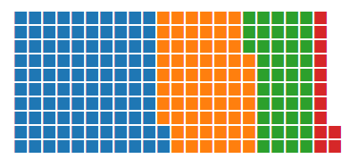
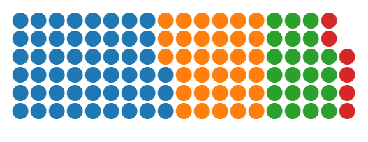

# d3-waflle

**d3-waffle**  is a waffle (viz) maker *a la* D3. 

## Live Demo

You can see how it looks [here](https://rawgit.com/jbkunst/d3-waffle/master/index.html).

## How to use

1. Choose your selector!
2. Prepare your data like `[{ name: "yay!", value: 80}, ...]`
2. Cook the `d3waffle()` with your parameters 
3. And eat it!

### Simple example 
```
var data = [
    { "name": "type 1", "value": 102},
    { "name": "type 2", "value": 65},
    { "name": "type 3", "value": 43},
    { "name": "type 4", "value": 12}
  ]

var chart = d3waffle();

d3.select("#container")
			.datum(data)
			.call(chart);
```



## Options

You can change:
- Values scale (a positive number)
- The icon (unicode string by now)
- The number of rows to show (an integer)
- The color palette (a d3 quantitative function) 
- The timming effect (a function)

```
var chart2 = d3waffle()
			.rows(6)
            .icon("&#9679;")
            .scale(0.5); // basically is Math.round(value/5);

d3.select("#container2")
			.datum(data)
			.call(chart2);

```


#### Other examples

A relative more complex:
Source https://github.com/hrbrmstr/waffle from http://www.nytimes.com/2008/07/20/business/20debt.html

```
var data = [
  { "name": "Mortgage ($84,911)", "value": 84911},
  { "name": "Auto and\ntuition loans ($14,414)", "value": 14414},
  { "name": "Home equity loans ($10,062)", "value": 10062},
  { "name": "Credit Cards ($8,565)", "value": 8565}
]

/* to color elements we use the class name ( slugigy(name) ) */
/* include in d3-waflle.js */
var domain = data.map(function(d){ return slugify(d.name); })
var range = ["#c7d4b6", "#a3aabd", "#a0d0de", "#97b5cf"]
var palette = d3.scale.ordinal().domain(domain).range(range);

var chart4 = d3waffle()
              .rows(7)
              .scale(1/392)
              .colorscale(palette)
              .appearancetimes(function(d, i){ return i*10 + Math.random()*250;})
              .height(150);

d3.select("#container4")
      .datum(data)
      .call(chart4);
```


## Requirements

This plugin needs only [d3js](http://d3js.org/)!

## References and related workd

1. https://gist.github.com/XavierGimenez/8070956
1. http://d3js.org/
1. [Day/Hour Heatmap by tjdecke](http://bl.ocks.org/tjdecke/5558084)
1. https://github.com/hrbrmstr/waffle
1. Legends idea from http://bl.ocks.org/kramer/4745936
1. https://rud.is/b/2015/03/26/pre-cran-waffle-update-isotype-pictograms/ (yay I keep drying ;) )

## News
- Version 0.1.2 released (2015-07-13). Legend funcionality
- Version 0.1.1 released (2015-07-07). Adding better tooltips, general idea from [d3vennjs](http://benfred.github.io/venn.js/examples/intersection_tooltip.html). Now, there is FontAwesome support, using the unicode (http://fortawesome.github.io/Font-Awesome/cheatsheet/). Adding `adjust` parameter because some icons are bigger so you can (need) adjust the size font (size * factor + "px")
- Version 0.1 released (2015-07-07). Minimal functionalities. 

## Future Work

- Improve tooltips
- Improve Legends

## Known bugs

- When you move the curso from left to right the mouse icon change to *text selection* reducing the UX quality.
